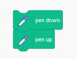

Get the sprite to draw a grid of dots, spaced distance 20 apart, as shown.

Do this using as little code as possible. The picture shows that you can do this with only a few blocks.

The way to draw a dot is to move the sprite to the correct x y position then have it execute this code:

[Back to Challenges](../README.md)