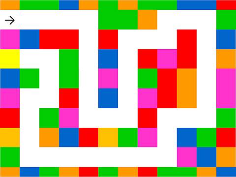
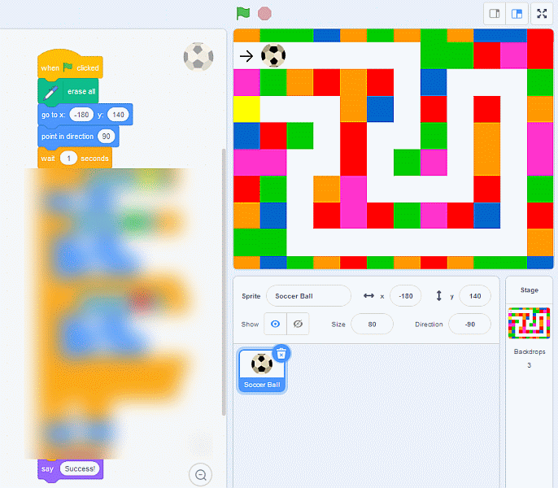

Here are three mazes. You have to write the code to get a ball sprite through the mazes to get to the yellow square. 

##Maze no 1:

	

Maze no 2:

	

Maze no 2:

	

Here is a Scratch project which has the three mazes and the sprite ready set up:

	[Scratch: maze challenge project](https://scratch.mit.edu/projects/341739604)

As you can see it is possible to solve all three mazes with quite a short programme:

[Back to Challenges](../README.md)